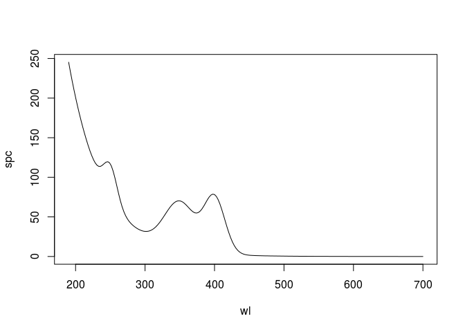
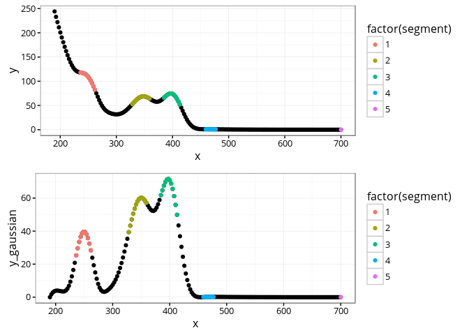
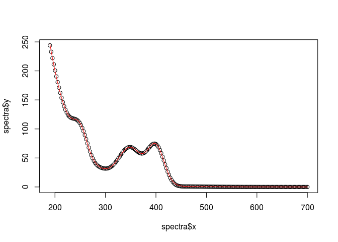

cdom [](https://travis-ci.org/PMassicotte/cdom) [](https://ci.appveyor.com/project/PMassicotte/cdom) [](http://www.gnu.org/licenses/gpl-2.0.html) [](http://cran.rstudio.com/package=cdom) [](http://www.r-pkg.org/pkg/cdom)
---------------------------------------------------------------------------------------------------------------------------------------------------------------------------------------------------------------------------------------------------------------------------------------------------------------------------------------------------------------------------------------------------------------------------------------------------------------------------------------------------------------------------------------------------------------------------------------------------------------------------------------------------------------------

The **cdom** package implements various functions used to model and calculate metrics from absorption spectra of chromophotic dissolved organic matter (CDOM).

This package provides:

1.  Simple wrappers to calculate common metrics found in the literature.
    -   The **spectral curve** (Loiselle et al. 2009).
    -   The **slope ratio (Sr)** (Helms et al. 2008).
    -   The **spectral slope (S)** (Jerlov 1968; Lundgren 1976; Bricaud, Morel, and Prieur 1981).

2.  The function to use the **Gaussian decomposition approach** proposed in Massicotte and Markager, (2015).

The package can be installed using the following command.

``` r
devtools::install_github("PMassicotte/cdom")
```

Please note that this is a developing version of the package for testing only. Please fill an issue when you find bugs.

All functions from the package start with the `cdom_` prefix.

``` r
library(cdom)
ls("package:cdom")
## [1] "build_model"          "cdom_fit_exponential" "cdom_slope_ratio"    
## [4] "cdom_spectral_curve"  "fitCDOMcomponents"    "spectra"
```

Examples
========

Gaussian decomposition
----------------------

**This should be used with care since it is in very early developpement.**

``` r
library(dplyr)
## 
## Attaching package: 'dplyr'
## The following objects are masked from 'package:stats':
## 
##     filter, lag
## The following objects are masked from 'package:base':
## 
##     intersect, setdiff, setequal, union
library(gsubfn)
## Loading required package: proto

set.seed(1234)

wl <- seq(190, 700, length.out = 200)

# Build the base exp model
a0  <- 10
S <- 0.02
K <- 0

exp_part <- a0 * exp(-S * (wl - 350)) + K
exp_part <- exp_part + rnorm(wl, sd = 0.001)

# Build 3 Gaussian components
p0 <- c(43, 60, 70)
p1 <- c(250, 350, 400)
p2 <- c(10, 22, 15)

params <- c(a0, S, K, as.vector(rbind(p0, p1, p2)))
ngaussian <- (length(params) - 3) / 3
n <- c("a0", "S", "K", paste0(rep(c("p0", "p1", "p2"), time = ngaussian),
       rep(letters[1:ngaussian], each = 3)))
params <- setNames(params, n)

myfunc <- build_model(ngaussian = ngaussian)

fo <- formula(sub(".*~", "~", deparse(myfunc)))
func <- gsubfn::fn$identity(fo)
spc <- do.call(func, c(list(x = wl), params))

# Plot a preview

plot(wl, spc, type = "l")
```

<!-- -->

``` r

# Decompose the generated spectra

myfit <- fitCDOMcomponents(x = wl, y = spc, min_distance = 50) %>%
  mutate(true_value = params) %>%
  select(parameter, true_value, guess, nls)
## Estimated number of components: 3
```

<!-- --><!-- -->

``` r

myfit
## Source: local data frame [12 x 4]
## 
##    parameter true_value        guess          nls
##        (chr)      (dbl)        (dbl)        (dbl)
## 1         a0      10.00  68.68442198   9.04811590
## 2          K       0.02   0.02921391   0.00000000
## 3          S       0.00   0.02000000   0.02065551
## 4        p0a      43.00  25.32752720  38.32015999
## 5        p1a     250.00 236.13065327 249.95115962
## 6        p2a      10.00   2.56281407  13.22924763
## 7        p0b      60.00  60.10952679  58.94969680
## 8        p1b     350.00 348.89447236 349.58230837
## 9        p2b      22.00   3.07537688  23.10931359
## 10       p0c      70.00  71.61019071  65.78835127
## 11       p1c     400.00 397.58793970 399.94114070
## 12       p2c      15.00   2.81909548  16.27522071
```

The spectral slope (S)
----------------------

The `cdom_fit_exponential()` function fits an exponential curve to CDOM data using the simple model proposed by Jerlov (1968), Lundgren (1976), Bricaud, Morel, and Prieur (1981).

``` tex
a(\lambda) = a(\lambda0)e^{-S(\lambda - \lambda0)} + K
```

``` r
library(ggplot2)
library(cdom)
data("spectra")

fit <- cdom_fit_exponential(wl = spectra$wavelength,
                       absorbance = spectra$spc3,
                       wl0 = 350,
                       startwl = 190,
                       endwl = 900)

ggplot(spectra, aes(x = wavelength, y = spc3)) +
  geom_point() +
  geom_line(aes(y = fit$data$.fitted), col = "red") +
  xlab("Wavelength (nm)") +
  ylab(expression(paste("Absorption (", m ^ {-1}, ")")))
```

<!-- -->

The slope ratio (SR)
--------------------

The `cdom_slope_ratio()` function calculates the slope ratio (S<sub>R</sub>) which is defined as: S<sub>275-295</sub>/S<sub>350-400</sub>. See Helms et al. (2008) for detailed information.

``` r
library(cdom)
data("spectra")

cdom_slope_ratio(spectra$wavelength, spectra$spc1)
## [1] 1.325082
```

The spectral curve
------------------

The `cdom_spectral_curve()` function generates the spectral curve using the slope of the linear regression between the natural log absorption spectrum and wavelengths over a sliding window of 21 nm interval (default) at 1 nm resolution. See Loiselle et al. (2009) for detailed information.

``` r
library(cdom)
data("spectra")

res <-  cdom_spectral_curve(wl = spectra$wavelength,
                       absorbance = spectra$spc10,
                       interval = 21,
                       r2threshold = 0.98) # Maybe to restrictive...

ggplot(res, aes(x = wl, y = s)) +
  geom_point() +
  geom_line() +
  xlab("Wavelength (nm)") +
  ylab(expression(paste("Spectral slope (", nm ^ {-1}, ")")))
```

<!-- -->

Data
====

A total 25 absorption spectra are provided in the package.

``` r
library(ggplot2)
library(tidyr)
data("spectra")

spectra <- gather(spectra, sample, absorption, -wavelength)

ggplot(spectra, aes(x = wavelength, y = absorption, group = sample)) +
  geom_line(size = 0.1) +
  xlab("Wavelength (nm)") +
  ylab(expression(paste("Absorption (", m ^ {-1}, ")")))
```

<!-- -->

How to cite the package
=======================

``` r
citation("cdom")
## 
## To cite cdom in publications use:
## 
##   Massicotte, P., and Markager, S. (2016). Using a Gaussian
##   decomposition approach to model absorption spectra of
##   chromophoric dissolved organic matter. Mar. Chem. 180, 24-32.
##   doi:10.1016/j.marchem.2016.01.008.
## 
## A BibTeX entry for LaTeX users is
## 
##   @Article{,
##     title = {Using a Gaussian decomposition approach to model absorption spectra of chromophoric dissolved organic matter},
##     author = {Philippe Massicotte and Stiig Markager},
##     journal = {Marine Chemistry},
##     year = {2016},
##     volume = {180},
##     pages = {24--32},
##     url = {http://linkinghub.elsevier.com/retrieve/pii/S0304420316300081},
##   }
```

References
==========

Bricaud, Annick, André Morel, and Louis Prieur. 1981. “Absorption by dissolved organic matter of the sea (yellow substance) in the UV and visible domains.” *Limnology and Oceanography* 26 (1): 43–53. doi:[10.4319/lo.1981.26.1.0043](https://doi.org/10.4319/lo.1981.26.1.0043).

Helms, John R., Aron Stubbins, Jason D. Ritchie, Elizabeth C. Minor, David J. Kieber, and Kenneth Mopper. 2008. “Absorption spectral slopes and slope ratios as indicators of molecular weight, source, and photobleaching of chromophoric dissolved organic matter.” *Limnology and Oceanography* 53 (3): 955–69. doi:[10.4319/lo.2008.53.3.0955](https://doi.org/10.4319/lo.2008.53.3.0955).

Jerlov, N.G. 1968. *Optical oceanography*. New York: Elsevier Publishing Company.

Loiselle, Steven A., Luca Bracchini, Arduino M. Dattilo, Maso Ricci, Antonio Tognazzi, Andres Cézar, and Claudio Rossi. 2009. “The optical characterization of chromophoric dissolved organic matter using wavelength distribution of absorption spectral slopes.” *Limnology and Oceanography* 54 (2): 590–97. doi:[10.4319/lo.2009.54.2.0590](https://doi.org/10.4319/lo.2009.54.2.0590).

Lundgren, Bo. 1976. “Spectral transmittance measurements in the Baltic.” Copenhagen: Institute Physical Oceanography University of Copenhagen.
