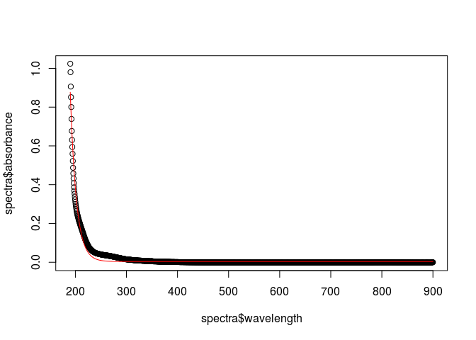

# Repository for the cdom R package.


This is the repository for the cdom R package. The package implements various functions used to model and calculate metrics from absorption spectra of chromophotic dissolved organic matter. 

Please not that this is a developing version of the package for testing only.

## Examples

### Calculate the *standard* spectral slope.


```r
library(cdom)
data("spectra")

plot(spectra$wavelength, spectra$absorbance)

fit <- fit_exponential(wl = spectra$wavelength,
                       spectra = spectra$absorbance,
                       wl0 = 350,
                       startwl = 190,
                       endwl = 900)

lines(spectra$wavelength, predict(fit), col = "red")
```

<<<<<<< HEAD
 
=======
 
>>>>>>> ced985cb2aef7e5988a43e31a96e784c3d4348fd


## References

Helms, John R., Aron Stubbins, Jason D. Ritchie, Elizabeth C. Minor, David J. Kieber, and Kenneth Mopper. 2008. “Absorption Spectral Slopes and Slope Ratios as Indicators of Molecular Weight, Source, and Photobleaching of Chromophoric Dissolved Organic Matter.” Limnology and Oceanography 53 (3): 955–69. doi:10.4319/lo.2008.53.3.0955.

Massicotte, Philippe, and Stiig Markager. 2015. “Using a Gaussian Decomposition Approach to Model Absorption Spectra of Chromophoric Dissolved Organic Matter.”
