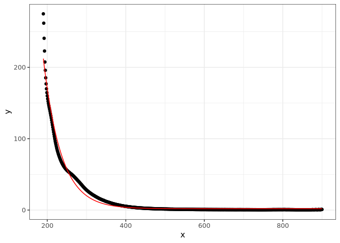
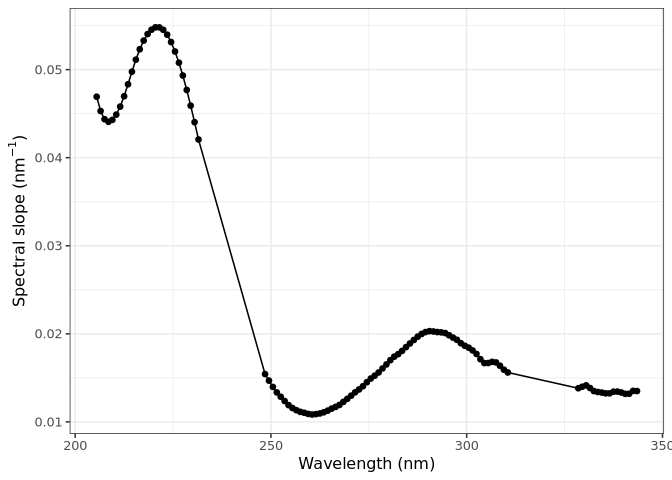
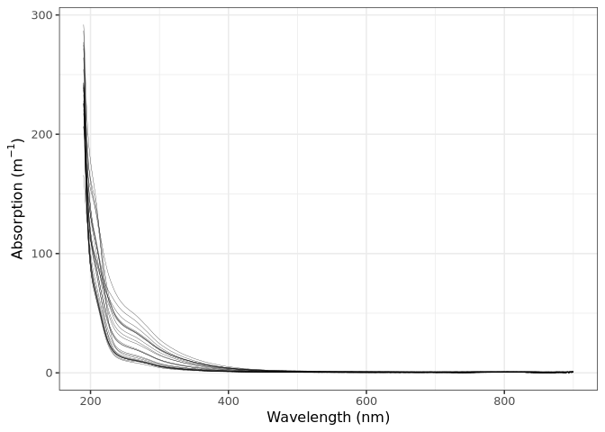

## cdom

<!-- badges: start -->

[](https://github.com/PMassicotte/cdom/actions/workflows/R-CMD-check.yaml)
[](https://cran.r-project.org/package=cdom)
[](https://www.gnu.org/licenses/gpl-2.0.html)

<!-- badges: end -->

The **cdom** package implements various functions used to model and
calculate metrics from absorption spectra of chromophotic dissolved
organic matter (CDOM).

This package provides:

1.  Simple wrappers to calculate common metrics found in the literature.
    - The **spectral curve** (Loiselle et al. 2009).
    - The **slope ratio (Sr)** (Helms et al. 2008).
    - The **spectral slope (S)** (Jerlov 1968; Lundgren 1976; Bricaud,
      Morel, and Prieur 1981).
2.  The function to use the **Gaussian decomposition approach** proposed
    in Massicotte and Markager, (2015).

The package can be installed using the following command.

``` r
devtools::install_github("PMassicotte/cdom")
```

Please note that this is a developing version of the package for testing
only. Please fill an issue when you find bugs.

All functions from the package start with the `cdom_` prefix.

``` r
library(cdom)
ls("package:cdom")
## [1] "cdom_exponential"    "cdom_slope_ratio"    "cdom_spectral_curve"
## [4] "spectra"
```

# Examples

## The spectral slope (S)

The `cdom_fit_exponential()` function fits an exponential curve to CDOM
data using the simple model proposed by Jerlov (1968), Lundgren (1976),
Bricaud, Morel, and Prieur (1981).

``` tex
a(\lambda) = a(\lambda0)e^{-S(\lambda - \lambda0)} + K
```

``` r
library(ggplot2)
library(cdom)
data(spectra)

fit <- cdom_exponential(
  wl = spectra$wavelength,
  absorbance = spectra$spc3,
  wl0 = 350,
  startwl = 190,
  endwl = 900
)

coef(fit)
##          S          K         a0 
## 0.02220677 1.85125088 6.02460462

p <- plot(fit)
## Warning: `aes_string()` was deprecated in ggplot2 3.0.0.
## ℹ Please use tidy evaluation idioms with `aes()`.
## ℹ See also `vignette("ggplot2-in-packages")` for more information.
## ℹ The deprecated feature was likely used in the cdom package.
##   Please report the issue at <https://github.com/PMassicotte/cdom/issues>.
## This warning is displayed once per session.
## Call `lifecycle::last_lifecycle_warnings()` to see where this warning was
## generated.
p
```

<!-- -->

## The slope ratio (SR)

The `cdom_slope_ratio()` function calculates the slope ratio
(S<sub>R</sub>) which is defined as:
S<sub>275-295</sub>/S<sub>350-400</sub>. See Helms et al. (2008) for
detailed information.

``` r
library(cdom)
data(spectra)

cdom_slope_ratio(spectra$wavelength, spectra$spc1)
## [1] 1.325082
```

## The spectral curve

The `cdom_spectral_curve()` function generates the spectral curve using
the slope of the linear regression between the natural log absorption
spectrum and wavelengths over a sliding window of 21 nm interval
(default) at 1 nm resolution. See Loiselle et al. (2009) for detailed
information.

``` r
library(cdom)
data(spectra)

res <- cdom_spectral_curve(
  wl = spectra$wavelength,
  absorbance = spectra$spc10,
  interval = 21,
  r2threshold = 0.98
) # Maybe to restrictive...

ggplot(res, aes(x = wl, y = s)) +
  geom_point() +
  geom_line() +
  xlab("Wavelength (nm)") +
  ylab(expression(paste(
    "Spectral slope (",
    nm^{
      -1
    },
    ")"
  )))
```

<!-- -->

## Using the pipe operator

``` r
library(dplyr)
## 
## Attaching package: 'dplyr'
## The following objects are masked from 'package:stats':
## 
##     filter, lag
## The following objects are masked from 'package:base':
## 
##     intersect, setdiff, setequal, union
library(tidyr)

data(spectra)

spectra_nested <- spectra %>%
  pivot_longer(
    starts_with("spc"),
    names_to = "sample",
    values_to = "absorption"
  ) %>%
  group_by(sample) %>%
  nest() %>%
  mutate(
    model = purrr::map(
      data,
      ~ cdom_exponential(
        .$wavelength,
        .$absorption,
        wl0 = 350,
        startwl = 190,
        endwl = 900
      )
    )
  )
```

# Data

A total 25 absorption spectra are provided in the package.

``` r
library(ggplot2)
library(tidyr)
data(spectra)

spectra <- pivot_longer(
  spectra,
  starts_with("spc"),
  names_to = "sample",
  values_to = "absorption"
)

ggplot(spectra, aes(x = wavelength, y = absorption, group = sample)) +
  geom_line(size = 0.1) +
  xlab("Wavelength (nm)") +
  ylab(expression(paste(
    "Absorption (",
    m^{
      -1
    },
    ")"
  )))
## Warning: Using `size` aesthetic for lines was deprecated in ggplot2 3.4.0.
## ℹ Please use `linewidth` instead.
## This warning is displayed once per session.
## Call `lifecycle::last_lifecycle_warnings()` to see where this warning was
## generated.
```

<!-- -->

# How to cite the package

``` r
citation("cdom")
## To cite cdom in publications use:
## 
##   Massicotte, P., and Markager, S. (2016). Using a Gaussian
##   decomposition approach to model absorption spectra of chromophoric
##   dissolved organic matter. Mar. Chem. 180, 24-32.
##   doi:10.1016/j.marchem.2016.01.008.
## 
## A BibTeX entry for LaTeX users is
## 
##   @Article{,
##     title = {Using a Gaussian decomposition approach to model absorption spectra of chromophoric dissolved organic matter},
##     author = {Philippe Massicotte and Stiig Markager},
##     journal = {Marine Chemistry},
##     year = {2016},
##     volume = {180},
##     pages = {24--32},
##     url = {https://linkinghub.elsevier.com/retrieve/pii/S0304420316300081},
##   }
```

# References

<div id="refs" class="references csl-bib-body hanging-indent"
entry-spacing="0">

<div id="ref-Bricaud-Morel-Prieur-1981" class="csl-entry">

Bricaud, Annick, André Morel, and Louis Prieur. 1981. “Absorption by
Dissolved Organic Matter of the Sea (Yellow Substance) in the UV and
Visible Domains.” *Limnology and Oceanography* 26 (1): 43–53.
<https://doi.org/10.4319/lo.1981.26.1.0043>.

</div>

<div id="ref-Helms-etal-2008" class="csl-entry">

Helms, John R., Aron Stubbins, Jason D. Ritchie, Elizabeth C. Minor,
David J. Kieber, and Kenneth Mopper. 2008. “Absorption Spectral Slopes
and Slope Ratios as Indicators of Molecular Weight, Source, and
Photobleaching of Chromophoric Dissolved Organic Matter.” *Limnology and
Oceanography* 53 (3): 955–69.
<https://doi.org/10.4319/lo.2008.53.3.0955>.

</div>

<div id="ref-Jerlov-1968" class="csl-entry">

Jerlov, N. G. 1968. *Optical Oceanography*. New York: Elsevier
Publishing Company.

</div>

<div id="ref-Loiselle-etal-2009" class="csl-entry">

Loiselle, Steven A., Luca Bracchini, Arduino M. Dattilo, Maso Ricci,
Antonio Tognazzi, Andres Cézar, and Claudio Rossi. 2009. “The Optical
Characterization of Chromophoric Dissolved Organic Matter Using
Wavelength Distribution of Absorption Spectral Slopes.” *Limnology and
Oceanography* 54 (2): 590–97.
<https://doi.org/10.4319/lo.2009.54.2.0590>.

</div>

<div id="ref-Lundgren-1976" class="csl-entry">

Lundgren, Bo. 1976. “Spectral Transmittance Measurements in the Baltic.”
Copenhagen: Institute Physical Oceanography University of Copenhagen.

</div>

</div>
