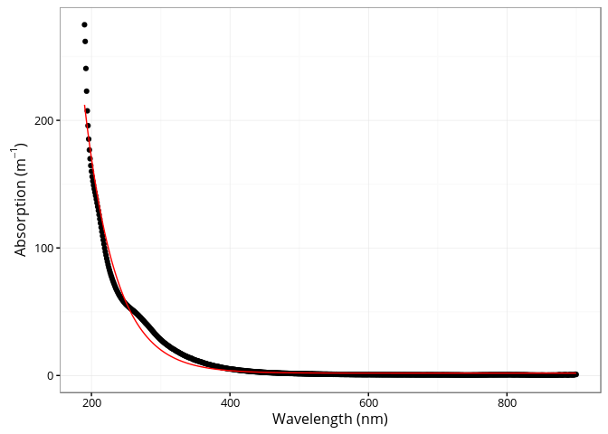

[](https://travis-ci.org/PMassicotte/cdom)

CDOM
====

The **cdom** package implements various functions used to model and calculate metrics from absorption spectra of chromophotic dissolved organic matter (CDOM).

This package provides:

1.  Simple wrappers to calculate common metrics found in the literature.
    -   The **spectral curve** -- Loiselle et al. (2009).
    -   The **slope ratio (Sr)** -- Helms et al. (2008).
    -   The **spectral slope (S)** -- Jerlov (1968).

2.  The function to use the **Gaussian decomposition approach** proposed in Massicotte and Markager, (2015).

The package can be installed using the following command.

``` r
devtools::install_github("PMassicotte/cdom")
```

Please note that this is a developing version of the package for testing only. Please fill an issue when you find bugs.

Examples
========

The spectral slope (S) by Jerlov (1968).
----------------------------------------

The `fit_exponential()` function fits an exponential curve to CDOM data using the simple model proposed by Jerlov et al. (1968).

``` tex
a(\lambda) = a(\lambda0)e^{-S(\lambda - \lambda0)} + K
```

``` r
library(cdom)
data("spectra")

fit <- fit_exponential(wl = spectra$wavelength,
                       spectra = spectra$absorbance,
                       wl0 = 350,
                       startwl = 190,
                       endwl = 900)

ggplot(spectra, aes(x = wavelength, y = absorbance)) +
  geom_point() +
  geom_line(aes(y = predict(fit)), col = "red") +
  xlab("Wavelength (nm)") +
  ylab(expression(paste("Absorbance (", m ^ {-1}, ")")))
```



The slope ratio (SR) by Helms et al. (2008).
--------------------------------------------

The `slope_ratio()` function calculates the slope ratio (S<sub>R</sub>) which is defined as: S<sub>275-295</sub>/S<sub>350-400</sub>. See Helms et al. (2008) for details.

``` r
library(cdom)
data("spectra")

slope_ratio(spectra$wavelength, spectra$absorbance)
#> [1] 0.7519547
```

The spectral curve by Loiselle et al. (2009).
---------------------------------------------

The `spectral_curve()` function generates the spectral curve using the slope of the linear regression between the natural log absorption spectrum and wavelengths over a sliding windows of 21 nm interval (default) at 1 nm resolution.

``` r
library(cdom)
data("spectra")

res <-  spectral_curve(spectra$wavelength, spectra$absorbance)

ggplot(res, aes(x = wl, y = s)) +
  geom_line() +
  xlab("Wavelength (nm)") +
  ylab(expression(paste("Spectral slope (", nm ^ {-1}, ")")))
```


References
==========

Helms, John R., Aron Stubbins, Jason D. Ritchie, Elizabeth C. Minor, David J. Kieber, and Kenneth Mopper. 2008. “Absorption spectral slopes and slope ratios as indicators of molecular weight, source, and photobleaching of chromophoric dissolved organic matter.” *Limnology and Oceanography* 53 (3): 955–69. doi:[10.4319/lo.2008.53.3.0955](http://dx.doi.org/10.4319/lo.2008.53.3.0955).

Jerlov, N.G. 1968. *Optical oceanography*. New York: Elsevier Publishing Company.

Loiselle, Steven A., Luca Bracchini, Arduino M. Dattilo, Maso Ricci, Antonio Tognazzi, Andres Cézar, and Claudio Rossi. 2009. “The optical characterization of chromophoric dissolved organic matter using wavelength distribution of absorption spectral slopes.” *Limnology and Oceanography* 54 (2): 590–97. doi:[10.4319/lo.2009.54.2.0590](http://dx.doi.org/10.4319/lo.2009.54.2.0590).
